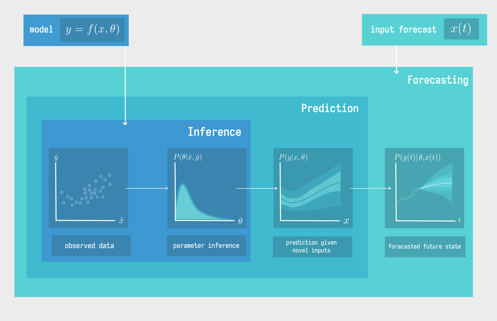

# Meta

**BOX 1: Biological Examples**

## What is the paper about?

## Who would benefit from it?

## Why do we need to predict interactions between species?

## Why predict networks before interactions?

## What is currently limiting our ability to predict network structure?

## What is currently enabling our ability to predict network structure?

{#fig:conceptual}

# A primer on predictive (network) ecology

## What are the most important properties of networks to predict?

## What is the added value of using machine learning?

## How do we fit a predictive model?

## How do we validate a predictive model?

## How do we propagate uncertainty through a predictive model?

## How do we determine what interaction networks are feasible?

# Interactions

**Box 2: Machine Learning Illustration**

## What is a species interaction?

## How do we predict how species that have never co-occurred will interact?

## What does interaction strength mean?

## How are interaction strengths actually inferred?

## Could we use hypergraphs and multi-layer networks to predict more interactions?

# Network predictions must have a spatial component

**Everything is connected figure**

## How much do networks vary over space?

## How do we predict what the species pool at a particular location is?

## How could predictions for individual species, such as those used by IPBES/IUCN, be improved by considering ecological interactions?

## What is the spatial scale suitable for the prediction of species interactions?

# Giving a temporal component to network predictions requires forecasting

## Box 3: From Models to Prediction to Forecasting

In ecology, quantitative models have long been used for descriptive rather than predictive purposes.
Yet, the need for predictive models remains clear to forecast the effects of Anthropogenic climate and land-use change on Earth's ecosystems [@Dietze2018IteNea].
The terms "prediction" and "forecasting" are often used interchangably.

Models are used for many purposes, however all models share some common properties.
Any model can be thought of as a function $f$, which maps inputs $x$ and parameters $\theta$ to predicted output states $y$. However, the approaches taken to define $f$ vary.

Various methods of partitioning the types of models have been made [@Breiman2000TwoSch; @McElreath2020StaRet]. Here, we define the following three categories of quantitative models: 1) process models, 2) statistical models, 3) machine-learning models.

Many forms of scientific inquiry (hypothesis testing, parameter inference)---are based around the inverse problem  [@Stouffer2019AllEco]. The goal of the inverse problem, effectively synonymous with "fitting" a model, is to estimate the parameters, $\theta$, that best explain a set of observations, $\{\hat{x}, \hat{y}\}$.

How we qualify the distance between our models predictions $f(\hat{x}, \theta)$ and our observed outputs $\hat{y}$ falls under the topic of _model comparison and validation_ (section TBD).

To make ecology predictive, we need to use our model to answer the forward problem.

Process-based models attempt to model the state of a system by quantifying how measurable states of the system effect oneanother, often in the form of differential/difference equations . In ecology, process-based models were long "toys" [@Okubo]---useful for exploring the outcomes of oversimplified versions of dynamics.

Statistical models are often used for inference and hypothesis testing.
The quantitative representation of "effects" in statistical models---the influence of each input on the output---is broadly assumed to be linear.
In the frequentist context, this often boils down to "significance".

On some scales, empirical time-series encode enough information about
the process for machine-learning approaches to make accurate forecasts.

However, its clear this approach won't work as we rapidly shift the abiotic
environment to conditions which have not been observed in the data.
 [@Evans2012PreEco].

Applied context.

Lots of uncertainty in what will work---iterative framework

Forecasting is the best way we have to validate process models.

The process from data to forecast.
{#fig:forecastingBox}

## What data do we need to turn a predictive model into a forecasting model?

## How can we validate a forecast, and would hindcasting help?

## What ecological knowledge would forecasting bring?

# References
