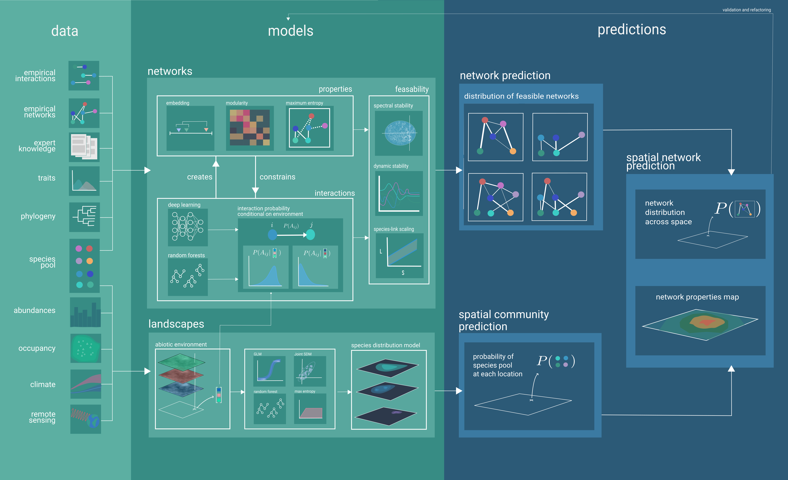

**BOX 1: Biological Examples**

## Why should we predict and forecast species interaction networks?

Networks of species interactionss underpin our understanding of key ecological
processes [@Pascual2006EcoNet; @Heleno2014EcoNet]. Although they have initially
be used to describe the interactions *within* a community, our interest in the
last decade has shifted towards understanding their structure and their
variation over space [@Trojelsgaard2016EcoNet; @Baiser2019EcoRul], and
established network ecology as an important emerging component of biogeography
and macroecology. But our understanding of network structure, and in particular
across space, is limited by availability of data. Characterizing a network
requires an exhaustive list of species interactions at the sampled location, and
these data remain extremely scarce. This is because sampling ecological
interactions is extremely difficult [@Jordano2016SamNet]; in turn, the
difficulty of sampling interactions can lead to biases in our estimate of the
sampling of network structure [@deAguiar2019RevBia]. As many ecological systems,
ecological networks have entered their "long now" [@Carpenter2002EcoFut], where
contemporary actions will have long-term, low-predictibility consequences,
sometimes over centuries [@Burkle2013PlaInt]. It is therfore imperative to
develop a roadmap that would enable prediction (for the present) and forecasting
(for the future) of network structure [@McCann2007ProBio; @Seibold2018NecMul],
of the processes it encodes [@Thompson2012FooWeb], that can account for the
spatial, temporal, and climate change dimensions [@Burkle2011FutPla]. In this
paper, we adopt a question-driven approach to identify opportunities,
roadblocks, and tools that are part of this research agenda.

## Who would benefit from it?

## Why do we need to predict interactions between species?

## Why predict networks before interactions?

## What is currently limiting our ability to predict network structure?

## What is currently enabling our ability to predict network structure?

{#fig:conceptual}

# A primer on predictive (network) ecology

## What are the most important properties of networks to predict?

## What is the added value of using machine learning?

## How do we fit a predictive model?

## How do we validate a predictive model?

## How do we propagate uncertainty through a predictive model?

## How do we determine what interaction networks are feasible?

# Interactions

**Box 2: Machine Learning Illustration**

## What is a species interaction?

## How do we predict how species that have never co-occurred will interact?

## What does interaction strength mean?

## How are interaction strengths actually inferred? 

## Could we use hypergraphs and multi-layer networks to predict more interactions? 

# Network predictions must have a spatial component

**Everything is connected figure**

## How much do networks vary over space?

## How do we predict what the species pool at a particular location is?

## How could predictions for individual species, such as those used by IPBES/IUCN, be improved by considering ecological interactions?

## What is the spatial scale suitable for the prediction of species interactions?

# Giving a temporal component to network predictions requires forecasting

**Box 3: Forecasting**

## What data do we need to turn a predictive model into a forecasting model?

## How can we validate a forecast, and would hindcasting help?

## What ecological knowledge would forecasting bring?

# References
